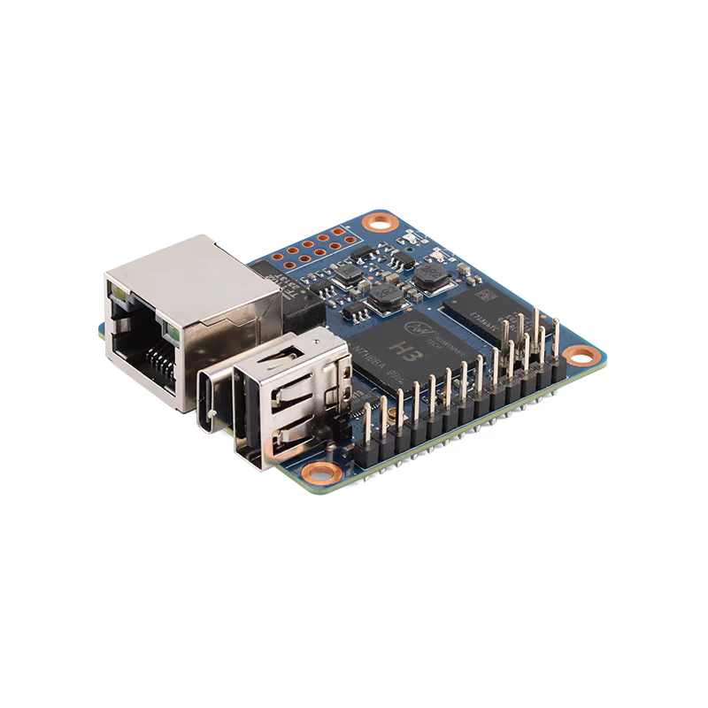
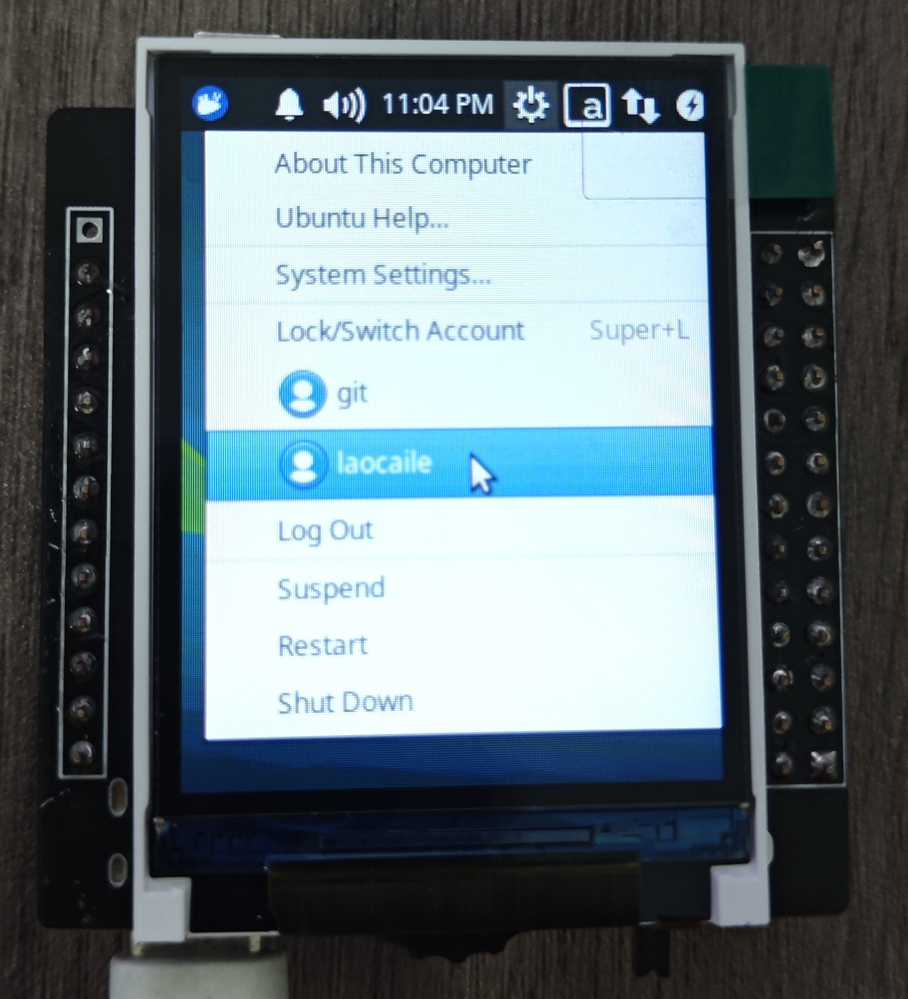
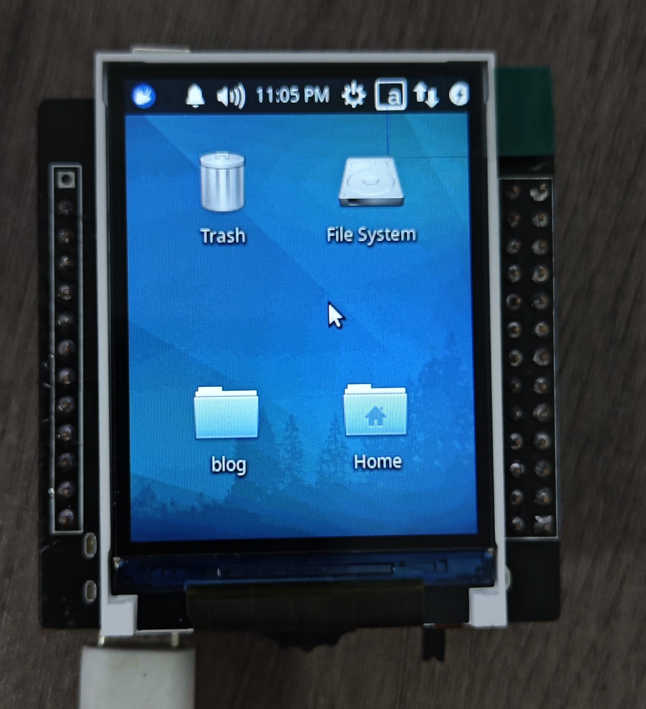
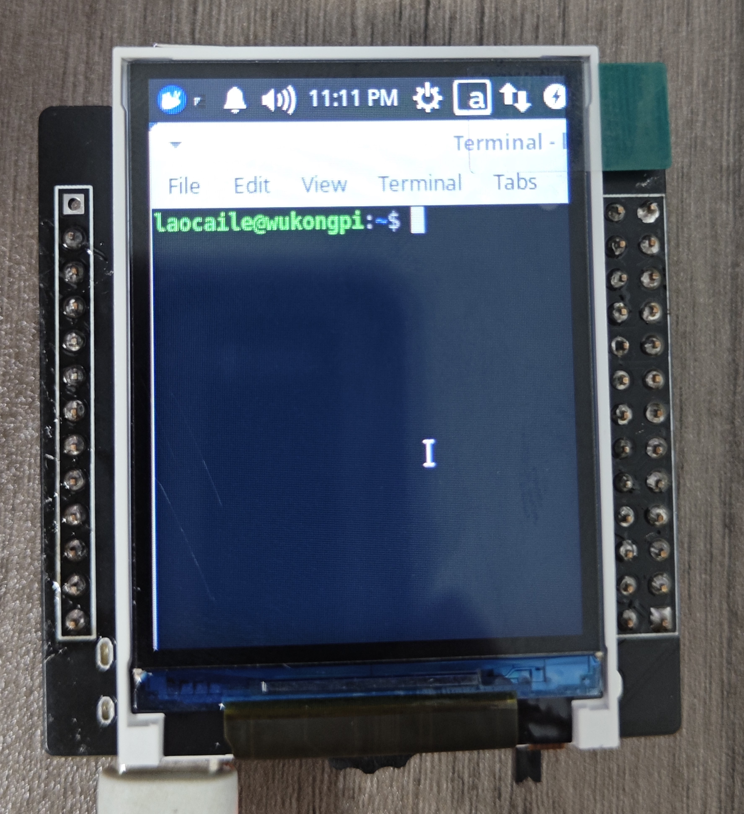
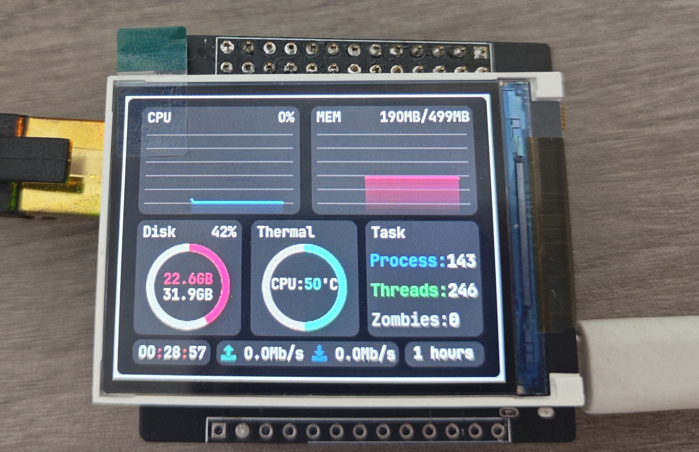

# WuKongPi_build

## 1. kernel
> 代码来自：https://github.com/orangepi-xunlong/linux-orangepi/tree/orange-pi-5.4

**添加以下修改：**
- 设置默认架构和编译工具  [dc4035b82](https://github.com/LaoCaiLe/WuKongPi_build/commit/dc4035b82)
- 添加wukongpi板子的dts文件  [2b3183155](https://github.com/LaoCaiLe/WuKongPi_build/commit/2b3183155)
- 删除无用架构（影响我敲tab）  [6dfc07b01](https://github.com/LaoCaiLe/WuKongPi_build/commit/6dfc07b01)
- 修改串口日志从uart1输出  [b6280c0e5](https://github.com/LaoCaiLe/WuKongPi_build/commit/b6280c0e5)
- 添加wukongpi_defconfig  [b01f6c92f](https://github.com/LaoCaiLe/WuKongPi_build/commit/b01f6c92f)
- 添加st7789v lcd屏幕驱动  [bfe726b3f](https://github.com/LaoCaiLe/WuKongPi_build/commit/bfe726b3f)/[a2c4000bf](https://github.com/LaoCaiLe/WuKongPi_build/commit/a2c4000bf)
- 添加framebuffer屏幕旋转支持  [5ff8d57e1](https://github.com/LaoCaiLe/WuKongPi_build/commit/5ff8d57e1)
- 添加SIQ-02FVS3旋转编码器驱动  [fa9758133](https://github.com/LaoCaiLe/WuKongPi_build/commit/fa9758133)
- 删除无用的dts文件  [e714c0e2e](https://github.com/LaoCaiLe/WuKongPi_build/commit/e714c0e2e)/[b9caa4ef9](https://github.com/LaoCaiLe/WuKongPi_build/commit/b9caa4ef9)
- 添加CPU温度查看支持  [3ca667057](https://github.com/LaoCaiLe/WuKongPi_build/commit/3ca667057)
- 支持使用mqueue接口  [9be889141](https://github.com/LaoCaiLe/WuKongPi_build/commit/9be889141)

**编译：**
```
make wukongpi_defconfig
make
```

**输出文件：**
```
arch/arm/boot/zImage
arch/arm/boot/dts/sun8i-h3-wukongpi.dtb
```

**烧录：**

将zImage 和 sun8i-h3-wukongpi.dtb 拷贝到放到SD卡，在uboot设置bootcmd：
```
load mmc 0:1 0x42000000 zImage; load mmc 0:1 0x43000000 sun8i-h3-wukongpi.dtb; bootz 0x42000000 - 0x43000000

```

## 2. uboot
> 代码来自：https://github.com/orangepi-xunlong/u-boot-orangepi/tree/v2020.04

**添加以下修改：**
- 添加wukongpi_defconfig  [bb477f8b5](https://github.com/LaoCaiLe/WuKongPi_build/commit/bb477f8b5)
- 设置默认架构和编译工具  [aade9f81a](https://github.com/LaoCaiLe/WuKongPi_build/commit/aade9f81a)
- 设置bootargs/bootcmd  [7ef7ecbff](https://github.com/LaoCaiLe/WuKongPi_build/commit/7ef7ecbff)
- 修改串口从uart0修改为uart1  [5c8c62e19](https://github.com/LaoCaiLe/WuKongPi_build/commit/5c8c62e19)
- 修改用enter键停在uboot命令行  [436d50a0d](https://github.com/LaoCaiLe/WuKongPi_build/commit/436d50a0d)

**编译：**
```
make wukongpi_defconfig
make
```

**输出文件：**
```
u-boot-sunxi-with-spl.bin
```

**烧录：**

电脑插入sd卡，在uboot文件夹输入烧写命令：
```
sudo dd if=u-boot-sunxi-with-spl.bin of=/dev/sdx bs=1024 seek=8

```

## 3. rootfs
> 根文件系统为[ubuntu-base-18.04-armhf](https://cdimage.ubuntu.com/ubuntu-base/releases/18.04.4/release)

```
搭建ubuntu xfce桌面
apt install -y xubuntu-desktop onboard rsyslog sudo dialog apt-utils ntp evtest udev
```

**命令：**
```
sudo systemctl stop lightdm -> 关闭xfce桌面
sudo systemctl start lightdm -> 打开xfce桌面
sudo systemctl restart lightdm -> 重启xfce桌面

sudo systemctl set-default multi-user.target -> 设置默认命令行模式启动
sudo systemctl set-default graphical.target -> 设置默认图形界面模式启动（设置后开机自动进入xfce桌面）
systemctl get-default -> 获取当前启动模式

```

> overlay路径存放根文件系统更改和添加的文件，添加如下修改
- 设置串口终端ttyS0自动登录root用户  [12a978833](https://github.com/LaoCaiLe/WuKongPi_build/commit/12a978833)
- 设置lcd屏幕终端tty自动登录root用户  [18fc548de](https://github.com/LaoCaiLe/WuKongPi_build/commit/18fc548de)
- 设置xfce桌面自动登录用户  [2f2d45879](https://github.com/LaoCaiLe/WuKongPi_build/commit/2f2d45879)
- 设置xfce登录配置  [bd1d5c890](https://github.com/LaoCaiLe/WuKongPi_build/commit/bd1d5c890)
- 起机时自动设置终端大小和类型  [fafd23d5e](https://github.com/LaoCaiLe/WuKongPi_build/commit/fafd23d5e)
- lightdm服务添加退出xfce时切换为tty1设备  [ebcdbbc1d](https://github.com/LaoCaiLe/WuKongPi_build/commit/ebcdbbc1d)
- 添加按键检测服务程序  [06cbc3ceb](https://github.com/LaoCaiLe/WuKongPi_build/commit/06cbc3ceb)
- 添加系统监测程序([github](https://github.com/LaoCaiLe/lv_performance_monitor/tree/on-board))  [0776be62a](https://github.com/LaoCaiLe/WuKongPi_build/commit/0776be62a)

## 4. pic







