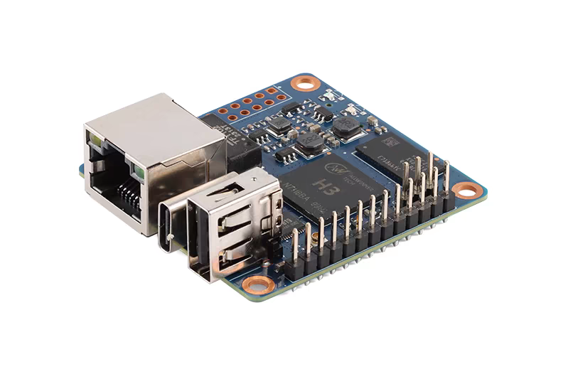

# WuKongPi_build

## kernel
> 代码来自：https://github.com/orangepi-xunlong/linux-orangepi/tree/orange-pi-5.4

**添加以下修改：**
- dc4035b82 设置默认架构和编译工具
- 2b3183155 添加wukongpi板子的dts文件
- b6280c0e5 修改串口日志从uart1输出
- b01f6c92f 添加wukongpi_defconfig
- 0b157cfef 添加CPU温度查看支持
- 5ff8d57e1 defconfig添加framebuffer屏幕旋转支持
- bfe726b3f/a2c4000bf 添加st7789v lcd屏幕驱动
- fa9758133 添加SIQ-02FVS3旋转编码器驱动

## uboot
> 代码来自：https://github.com/orangepi-xunlong/u-boot-orangepi/tree/v2020.04

**添加以下修改：**
- bb477f8b5 添加wukongpi_defconfig
- aade9f81a 设置默认架构和编译工具
- 7ef7ecbff 37dca7e75 设置bootargs/bootcmd
- 5c8c62e19 修改串口从uart0修改为uart1
- 436d50a0d 修改用enter键停在uboot命令行

## rootfs
> 根文件系统为ubuntu_base，地址：https://cdimage.ubuntu.com/ubuntu-base/releases/18.04.4/release/ubuntu-base-18.04.5-base-armhf.tar.gz

```
搭建ubuntu xfce桌面
apt install -y xubuntu-desktop onboard rsyslog sudo dialog apt-utils ntp evtest udev
```

> overlay路径存放根文件系统更改或添加的文件，添加如下修改
- 12a978833 设置串口终端ttyS0自动登录root用户
- 18fc548de 设置lcd屏幕终端tty1自动登录root用户
- 2f2d45879 设置xfce桌面自动登录用户


## pic


